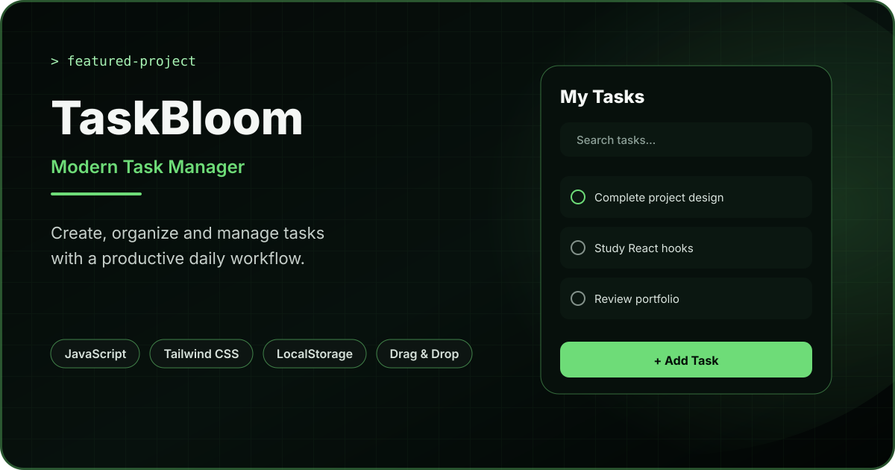

<div align="center">



<br/>

# TaskBloom

### Modern Task Management Application with JavaScript ES6+

A responsive productivity application for creating, organizing, searching, prioritizing, reordering and completing daily tasks with persistent browser storage.

[](https://taskbloom-todo-app.vercel.app/)
[](https://developer.mozilla.org/en-US/docs/Web/JavaScript)
[](https://tailwindcss.com/)
[](https://developer.mozilla.org/en-US/docs/Web/API/Window/localStorage)

</div>

---

## Overview

**TaskBloom** is a frontend task-management application built with HTML, Tailwind CSS and modular JavaScript ES6+.

The project goes beyond a basic todo list by combining full task CRUD operations, searchable task data, status filters, priorities, categories, due-date awareness, statistics, drag-and-drop ordering, theme persistence and reusable JavaScript modules.

Task data is stored locally in the browser, so the application remains useful across page refreshes without requiring a backend.

---

## Live Application

**Production:** https://taskbloom-todo-app.vercel.app/

---

## Core Features

### Task Management

- Create new tasks
- Edit existing task details
- Delete tasks with confirmation
- Mark tasks as completed or active
- Optional due dates
- Predefined task categories
- Low, Medium and High priority levels
- Task-title validation
- 80-character task-title limit

### Search

TaskBloom supports real-time search across:

- Task title
- Category
- Priority

The result count updates automatically as the user searches.

### Task Filters

Users can quickly switch between:

- All tasks
- Active tasks
- Completed tasks
- Overdue tasks

Search and status filtering work together, allowing users to narrow the visible task list dynamically.

### Due-Date Awareness

The UI identifies task deadlines and distinguishes between:

- No deadline
- Due today
- Overdue
- Future due dates

Completed tasks are excluded from overdue calculations.

### Productivity Statistics

The dashboard automatically calculates:

- Total tasks
- Completed tasks
- Tasks still in progress
- Overdue tasks

A dynamic focus message changes based on the current state of the task list.

### Drag & Drop Reordering

TaskBloom uses **SortableJS** to support task reordering with a dedicated drag handle.

The new order is written back to LocalStorage after a drag operation completes.

For data consistency, drag-and-drop is disabled when:

- A search query is active
- A status filter other than `All` is active
- Fewer than two tasks exist

This prevents a partially filtered view from accidentally replacing the order of the full task collection.

### Edit Experience

Tasks can be updated through a dedicated modal that supports editing:

- Title
- Category
- Priority
- Due date

The modal also supports:

- Click-outside closing
- Cancel action
- Escape-key closing
- Automatic input focus when opened

### Theme Experience

- Light theme
- Dark theme
- System color-scheme detection on first visit
- Saved theme preference in LocalStorage
- Accessible theme-toggle state

### Notifications

Task actions provide toast feedback for events such as:

- Task created
- Task updated
- Task deleted
- Completion status changed
- Task order changed
- Theme changed
- Storage errors

---

## Browser Persistence

TaskBloom stores data directly in the browser.

### Task data

```text
taskBloomTasks
```

### Theme preference

```text
taskBloomTheme
```

The storage module includes error handling for malformed or unavailable LocalStorage data and safely falls back to an empty task list when necessary.

---

## Frontend Architecture

TaskBloom separates application responsibilities across ES modules instead of keeping all logic in one large script.

```text
index.html
│
├── src/
│   ├── assets/
│   │   ├── empty-state.svg
│   │   └── favicon.svg
│   │
│   ├── css/
│   │   └── style.css
│   │
│   └── js/
│       ├── app.js
│       ├── dragDrop.js
│       ├── storage.js
│       ├── theme.js
│       ├── toast.js
│       ├── ui.js
│       └── utils.js
│
├── docs/
│   └── taskbloom-cover.svg
│
└── README.md
```

### Module Responsibilities

| Module | Responsibility |
| --- | --- |
| `app.js` | Application state, CRUD operations, filters, search and event handling |
| `ui.js` | Task rendering, deadline states, empty state and statistics |
| `storage.js` | LocalStorage task persistence |
| `dragDrop.js` | SortableJS initialization and reordered task IDs |
| `theme.js` | Theme initialization, switching and persistence |
| `toast.js` | Toast notification abstraction |
| `utils.js` | IDs, date helpers, overdue logic and safe text rendering |

---

## Engineering Highlights

### Modular JavaScript

The application uses native ES modules to keep UI, storage, theme, drag-and-drop and utility responsibilities separated.

### Derived UI State

The visible task list is calculated from the complete task collection using both the current search keyword and selected status filter rather than maintaining multiple duplicated arrays.

### Persistent Ordering

Drag-and-drop changes update the main task collection and are immediately persisted so the chosen order survives a browser refresh.

### Defensive Browser Storage

LocalStorage reads are wrapped in error handling and validate that parsed task data is actually an array before using it.

### Safer Dynamic Rendering

Task values are escaped before being inserted into generated HTML, reducing the risk of user-entered content being interpreted as markup.

### Event Delegation

Task actions such as complete, edit and delete are handled through the task-list container using `data-action` attributes instead of registering separate listeners for every task card.

### Accessible Interaction Details

The interface includes descriptive button labels, `aria-pressed` states, a dialog-style edit modal and an `aria-live` task-list region.

---

## Tech Stack

| Area | Technology |
| --- | --- |
| Structure | HTML5 |
| Styling | Tailwind CSS + Custom CSS |
| Language | JavaScript ES6+ |
| Architecture | ES Modules |
| Persistence | LocalStorage API |
| Drag & Drop | SortableJS 1.15.6 |
| Notifications | ToastifyJS |
| Icons | Font Awesome |
| Typography | Google Fonts |
| Deployment | Vercel |

> Tailwind CSS, SortableJS, ToastifyJS and Font Awesome are loaded from CDNs in the current implementation, so the project does not require a frontend build pipeline to run.

---

## Run Locally

Clone the repository:

```bash
git clone https://github.com/devjit1520/Todo_Manager.git
cd Todo_Manager
```

Because the project uses ES modules, serve it through a local HTTP server rather than opening `index.html` directly from the filesystem.

For example, with Node.js installed:

```bash
npx serve .
```

You can also use any IDE or editor that provides a local static server.

---

## Application Flow

```text
Page loads
   ↓
Initialize saved/system theme
   ↓
Read tasks from LocalStorage
   ↓
Render task list + statistics
   ↓
User creates / edits / completes / deletes / reorders task
   ↓
Update application state
   ↓
Persist task collection
   ↓
Re-render filtered UI
```

---

## What This Project Demonstrates

TaskBloom demonstrates practical frontend fundamentals without relying on a framework:

- DOM manipulation
- State management with JavaScript arrays and objects
- CRUD workflows
- Form validation
- ES modules
- Event delegation
- Search and filtering logic
- Date-based application rules
- LocalStorage persistence
- Third-party library integration
- Drag-and-drop ordering
- Responsive UI development
- Dark/light theme management
- Accessible interaction patterns

---

## Future Improvements

Potential next improvements include:

- Custom user-created categories
- Sort controls for due date and priority
- Recurring tasks
- Task notes and subtasks
- Import/export support
- Cloud synchronization
- Authentication
- Cross-device task persistence
- Automated tests
- Offline-first PWA support

---

## Author

**Devjit Mondal**  
Frontend Developer

- Portfolio: https://portfolio-devjit.vercel.app/
- GitHub: https://github.com/devjit1520
- LinkedIn: https://www.linkedin.com/in/devjit-mondal-b68947233/

---

Built as a portfolio project to demonstrate practical JavaScript, UI engineering and browser-side state management.